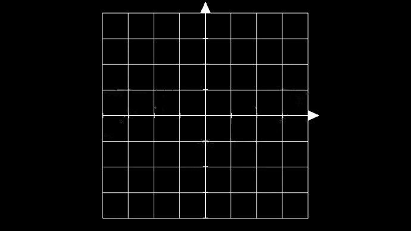
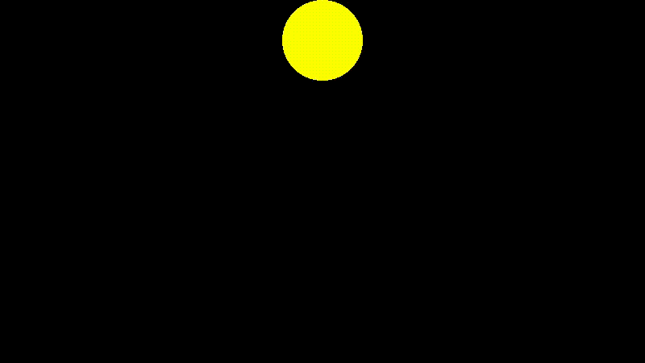
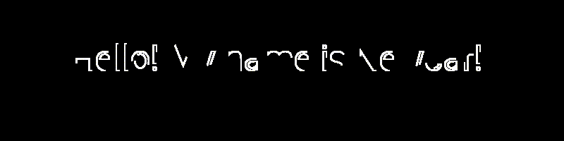
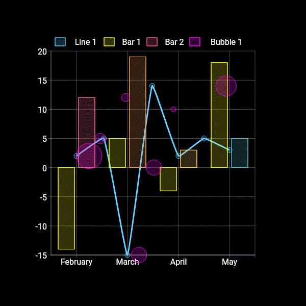

  <h1>Newcar</h1>
  
A modern animation engine for JavaScript ecosystem

  
  
  
  
  
  
  

---

## Examples Preview

<table>
  <tr>
    <td>
      
    </td>
    <td>
      
    </td>
    <td>
      
    </td>
  </tr>
  <tr>
    <td></td>
    <td></td>
    <td></td>
  </tr>
</table>

---

## 📔 Introduction

Newcar is a highly configurable and advanced universal engine designed for rapid animation creation. It is suitable for a wide range of applications, including video clips, dynamic charts (planned for the future), and even 2D game development (also planned for the future).

## 🌟 Features

- **Rich API Interfaces** 🛠️: Offers powerful and diverse APIs, providing you with greater flexibility in animation creation.
- **Based on CanvasKit-WASM** 🧬: Utilizes CanvasKit-WASM to minimize communication and data exchange between the CPU and GPU, ensuring robust animation performance.
- **High Degree of Customization** ⚙️: Features strong customizability, allowing you to create unique animation styles.
- **Chain Syntax** ⛓️: Enables the use of chain syntax for a more efficient development process, eliminating the need to save objects into variables.

## 🚗 Future plans

1. From the mods directory under the project root directory, it can be seen that newcar has already released mathematical modules (including number axes, planar Cartesian coordinate systems, function images, etc.). Unpublished modules include: geometry module, markup module, dynamic chart module, UI module, physics module, mind map module, etc
2. In the future, an event system will be launched to turn it into a two in one engine for animation games
3. Some small things, such as animation trees

## 📖 Documentation

- The tutorials is available at [newcarjs.org](https://newcarjs.org)
- The API References is available at [apis.newcarjs.org](https://apis.newcarjs.org)
- The Playground is deployed at [playground.newcarjs.org](https://playground.newcarjs.org)

_Copyright (c) 2022-present, BugDuck Team & Dromara Community_

**Note: Newcar is a open-source project which belong to Dromara Community and maintained by BugDuck Team. The members of BugDuck just join with a personal identity, BugDuck Team will always keep its independence**

## ✨ Stargazers over time

