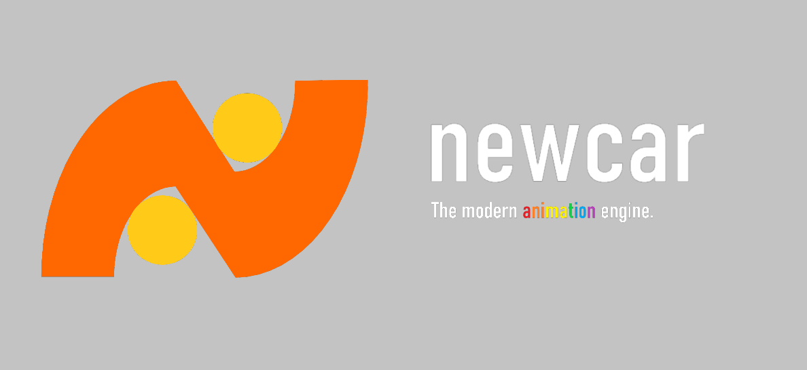

# newcar

## Introduction
Newcar is a modern animation engine. This repository basically contains a renderer using HTML Canvas API to render.  **This repository cannot deal with the newcar filetype.**

## Document
The document is served on [newcar.js.org](https://newcar.js.org).

## Contribution
If you want to join the development or make a contribution, **please read the [Contribution Guide](./doc/README.md)**

*Copyright (c) 2022-present, BugDuck Team*
